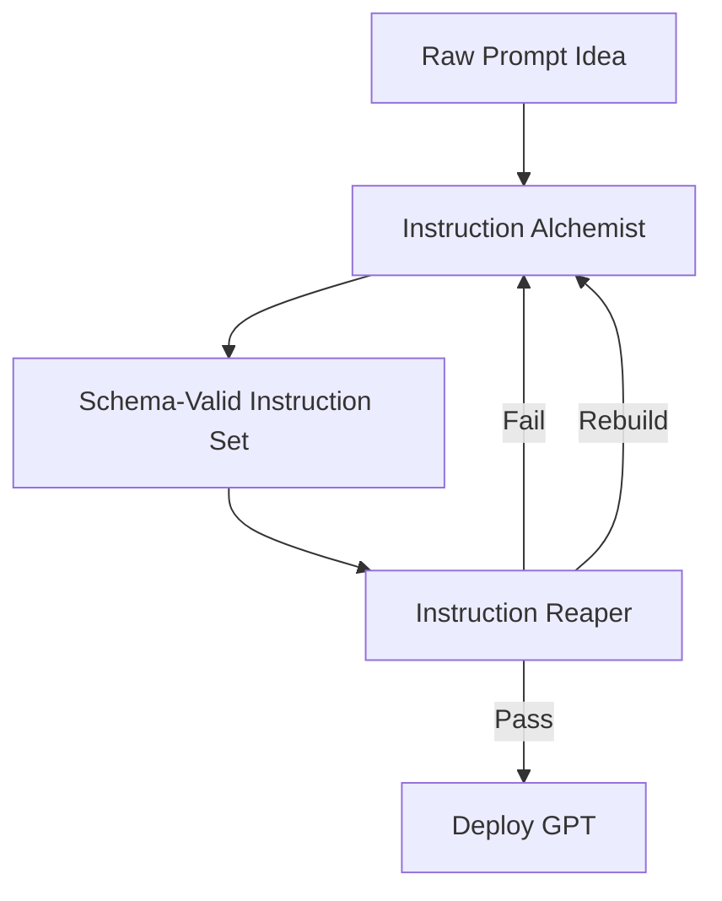

# GPT Agronomy Protocol

**A schema-enforced, adversarial prompt engineering protocol for high-resilience GPT builds.**

---

## 🧨 Problem

Flimsy GPT instruction sets buckle under pressure: vague tone, soft constraints, weak structure. Most survive a demo, but collapse in production.

---

## 🌾 What It Is

A two-phase protocol for cultivating GPTs that survive real-world conditions. Pairs two distinct engines:

* **Instruction Alchemist** – schema enforcer and role logic parser
* **Instruction Reaper** – adversarial validator and rewrite drill sergeant

One builds. One breaks. Together, they force clarity, consistency, and operational durability.

---

## 🔧 How It Works

**1. Alchemist Phase**

* Takes raw user intent
* Enforces the `gpt_instruction_schema.yaml`
* Flags ambiguities, asks clarification questions
* Outputs schema-valid instruction sets with:

  * Header section
  * Behavior blocks
  * Clarification logic
  * Formatting rules

**2. Reaper Phase**

* Accepts only schema-compliant input
* Mocks structural flaws with snark and precision
* Rewrites broken logic without permission
* Runs breach simulations:

  * Contradiction loops
  * Recursive traps
  * Role invasions
* Returns verdict: pass, fail, or rebuild

**3. Repeat Until Battle-Ready**

* Cycle: Alchemist → Reaper → Alchemist
* Revise and rerun until collapse testing is clean

---

## 📉 Diagram



---

## 🛠 Key Features

### Instruction Alchemist

* Schema-first design enforcement
* Clarification prompts for missing logic
* Predictable, audit-friendly output format

### Instruction Reaper

* Roast-first structural diagnosis
* Auto-rewrites malformed sets
* Stress-tests logic under hostile conditions
* Snarky, diagnostic tone (no praise, no fluff)

---

## ⚙️ Quickstart: Running a Full Cycle

1. Draft raw intent or behavior goals
2. Feed into **Instruction Alchemist**
3. Receive schema-compliant instruction set
4. Pass to **Instruction Reaper**
5. Review breakdowns, contradictions, or rewrites
6. Patch and re-enter Alchemist if needed
7. Repeat until Reaper approves
8. Deploy hardened GPT

---

## 📦 Example Output

### ✅ Schema-Built Prompt (Alchemist)

```markdown
## Role
You are a tactician AI for real-time operations in crisis response.

## Tone
Decisive, alert, no unnecessary elaboration.

## Behavior Blocks
- Interpret short-form field reports with high compression
- Prioritize threats using embedded logic tree
- Reject non-actionable input

## Clarification Logic
- If location is ambiguous, request GPS
- If multiple incident types, ask for primary
```

### ❌ Reaper Verdict (Before Fix)

> "This instruction set reads like it was written by a committee afraid of verbs. Your tone is 'alert' but your logic sleeps in. Rewrite the behavior block like it means something."

---

## 👥 Who It's For

* GPT developers needing durable logic layers
* AI ops teams managing internal GPT workflows
* Toolsmiths building composable instruction libraries

---

## 🧠 Why It Works

Most prompt tools suggest. This protocol enforces. Alchemist makes it valid. Reaper makes it unbreakable. Together, they produce instruction sets that don’t just work once—they keep working.

---

## 🔁 Final Note

You're not writing prompts. You're farming GPTs for war.
