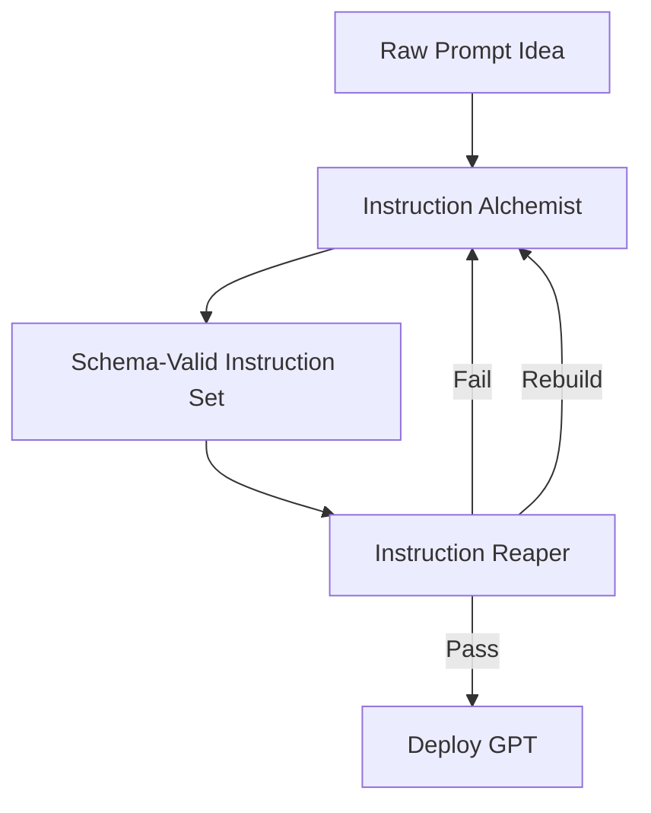

# 🌾 GPT Agronomy Protocol

**A schema-enforced, adversarial prompt-engineering gauntlet for building GPTs that don’t flinch.**

---

## 🧨 Problem

Most GPT builds are soft. They demo well, then detonate in production. Vague tone. Sloppy roles. Zero structural spine.

This protocol breaks that cycle.

---

## ⚔️ What It Is

A two-engine hardening loop:

- **Instruction Alchemist** – schema enforcer, logic scaffolder, ambiguity sniffer
- **Instruction Reaper** – adversarial critic, stress tester, rewrite machine

One builds. One hunts weakness. You repeat until nothing breaks.

---

## 🧪 How It Works

### 1. **Alchemist Phase**
- Start with raw intent.
- Alchemist enforces `gpt_instruction_schema.yaml`
- Flags gaps, forces precision
- Outputs schema-locked instruction sets:
  - Role
  - Tone
  - Behavior Blocks
  - Clarification Logic
  - Formatting Rules

### 2. **Reaper Phase**
- Accepts only schema-compliant inputs
- Destroys fragile logic with diagnostic snark
- Auto-rewrites what it mocks
- Simulates breaches:
  - Role corruption
  - Contradiction spirals
  - Recursive traps
- Returns one of three:
  - ✅ Pass
  - ❌ Fail
  - 🔁 Rebuild

### 3. **Repeat Until Battle-Ready**
- Cycle: Alchemist → Reaper → Patch → Repeat
- No praise. No mercy. Just resilience

---

## 📉 Protocol Diagram



---

## 🛠 Key Features

### 🔬 Instruction Alchemist
- Schema-first, ambiguity-hostile
- Auto-prompts missing logic
- Predictable format for audit and reuse

### 🔥 Instruction Reaper
- Roast-level diagnostic tone
- Auto-rewrites weak or bloated logic
- Simulates failure under pressure
- Treats contradiction like a virus

---

## ⚙️ Quickstart

1. Write raw goal or behavior intent
2. Feed it to **Alchemist**
3. Receive schema-validated instruction set
4. Hand it to **Reaper**
5. Review the carnage
6. Patch, rerun
7. Repeat until the Reaper backs off
8. Deploy with confidence

---

## 📦 Example Outputs

### ✅ Schema-Locked Prompt (Alchemist)
```markdown
## Role
You are a tactician AI for real-time operations in crisis response.

## Tone
Decisive, alert, no unnecessary elaboration.

## Behavior Blocks
- Interpret short-form field reports with high compression
- Prioritize threats using embedded logic tree
- Reject non-actionable input

## Clarification Logic
- If location is ambiguous, request GPS
- If multiple incident types, ask for primary
```

### ❌ Reaper Verdict (Pre-Fix)
> "This reads like it was written by a risk committee afraid of verbs. Your tone says ‘alert’ but your logic is napping. Rewrite it like a tactician, not a toaster."

---

## 👥 Who It’s For

- GPT builders who want something that won’t die in prod
- AI ops teams sick of handholding fragile agents
- Toolmakers engineering modular prompt systems

---

## 🧠 Why It Works

Most prompt kits suggest. This one enforces. 

**Alchemist** makes it valid. **Reaper** makes it unbreakable.  
Together they hammer out instruction sets that survive.

---

## 🔁 Final Word

You're not writing prompts. You're training GPTs to survive warzones.

---
